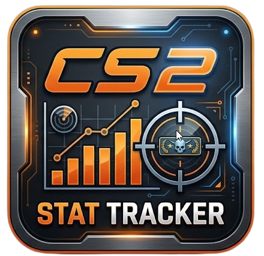

<div align="right">

**English** · [Français](README.fr.md)

</div>

# CS2 Tracker



Windows stat-tracking app for **Counter-Strike 2**, with a local REST API,
live match tracking, and an explainable heuristic anti-cheat engine.

```
┌─ Steam Web API ─────┐      ┌─ CS2 (Game State Integration) ─┐
│ profiles · stats    │      │ match state, 10×/second        │
│ VAC bans            │      └────────────┬───────────────────┘
└──────────┬──────────┘                   │
           └─────────────┬────────────────┘
                         ▼
              ┌──── local API ─────┐
              │ FastAPI · SQLite   │──▶ native window (default)
              │ anti-cheat engine  │──▶ in-game overlay
              └────────────────────┘──▶ your own tools
```

---

## What it does

| | |
|---|---|
| **Full profile** | Identity (SteamID64/2/3), account age, level, friends, library, achievements |
| **Lifetime stats** | Kills, accuracy, headshots, damage, MVPs, rounds — per weapon and per map |
| **Ranking** | Every stat placed against the population: "top 8 %", "Excellent" |
| **Live** | Score, round, phase, bomb, scoreboard, event feed |
| **In-game overlay** | Native panel on top of CS2, no injection ([`overlay/`](overlay/)) |
| **Bans** | VAC and game bans, recency, community restrictions |
| **Anti-cheat** | 0–100 suspicion score with every contributing indicator spelled out |
| **Lobby import** | Paste a `status` dump from the CS2 console to analyse all 10 players |
| **History** | Timestamped snapshots, trend charts, sudden skill-jump detection |
| **REST API** | ~40 documented endpoints, open to your own tools |

---

## Install

### Option A — the executable (recommended)

1. Download `CS2Tracker.exe` from the [Releases](../../releases) page.
2. Double-click it.

An **application window** opens. No terminal, no browser: the interface is
rendered by WebView2, the engine already built into Windows.

Closing the window does not quit the program — it keeps running in the
notification area so the API can receive game data while you play. Click the
icon to reopen the window, or pick **Quitter** to exit for real.

Also download `CS2TrackerOverlay.exe` and place it **next to** the main
executable if you want the in-game display.

No Python, no dependencies. A data folder is created at
`%LOCALAPPDATA%\CS2Tracker`.

### Option B — from source

```powershell
git clone https://github.com/LooperSalty/cs2-tracker.git
cd cs2-tracker
python -m pip install -r requirements.txt
python run.py
```

Python 3.11 or later.

---

## Two-step setup

### 1. Steam API key

Required to read profiles. It is **free** and takes a minute to get at
[steamcommunity.com/dev/apikey](https://steamcommunity.com/dev/apikey).

Paste it in the app's **Configuration** tab, or create a `.env` file at the
repository root:

```ini
STEAM_API_KEY=YOUR_KEY_HERE
```

The key is written only to that local file and is only ever sent to Steam. It
takes effect immediately — no restart needed.

> If several Steam accounts exist on your PC, the app **asks** which one is
> yours instead of guessing. The API key belongs to whichever account was
> signed in on the Steam *website*, while auto-detection can only see the Steam
> *client* — and nothing links the two.

### 2. Live link with CS2

**Configuration** tab → **Installer**. The app writes
`gamestate_integration_cs2tracker.cfg` into the CS2 config folder. Then
**restart CS2**.

This is Valve's official mechanism: the game itself pushes its state to the
app. Nothing is read from memory, nothing is injected.

> In a normal match, CS2 only transmits **your own** state. Data for every
> player only arrives in spectator mode or on a GOTV broadcast — that is a
> deliberate Valve restriction, not a limitation of this app. Use the lobby
> import to analyse opponents in a normal match.

---

## Usage

```powershell
CS2Tracker.exe                      # native window + API (default)
CS2Tracker.exe --overlay            # also start the in-game overlay
CS2Tracker.exe --browser            # interface in your browser instead
CS2Tracker.exe --api-only           # API only, for a third-party client
CS2Tracker.exe --analyse <steamid>  # console analysis report
CS2Tracker.exe --install-gsi        # write the GSI config, then exit
```

Interactive API docs: `http://127.0.0.1:8642/docs`.

### The in-game overlay

**Configuration** tab → **Lancer l'overlay**, or from the notification-area
icon. It shows the score, round, bomb timer and per-player risk on top of CS2.

**Set CS2 to "Fullscreen Windowed"** — a layered window cannot draw on top of
an exclusive-fullscreen application.

`F8` hide · `F9` move · `Ctrl+Shift+F8` quit.

---

## The anti-cheat engine

**What it produces**: a 0–100 suspicion score, a verdict, and above all **the
list of indicators that pushed it up**, each with its measurement, its
population reference and its sample size.

**What it is not**: proof. Only Valve holds the evidence (client memory, server
telemetry) needed to conclude.

### Principle

About thirty detectors across eight families compare the player to reference
distributions. Three safeguards keep the engine conservative:

1. **Confidence gates everything.** A 100 % headshot rate over 3 kills triggers
   nothing: rates are Bayesian-smoothed and weighted by sample size.
2. **Corroboration beats intensity.** Several *independent* families must agree
   before the score approaches the top. One outlier, however extreme, is not
   enough.
3. **Coverage is accounted for.** With no gameplay stats, the verdict becomes
   `INDÉTERMINÉ` rather than guessing blind.

### Indicator families

| Family | What it measures |
|---|---|
| **Aim** | Headshot rate, accuracy, hits and bullets per kill, damage per kill |
| **Weapons** | Spray accuracy, per-category profile, uniformity across weapons |
| **Progression** | Performance relative to hours played, K/D, MVP and win rates |
| **Account** | Age, privacy, library size, social footprint |
| **Live** | Observed HS rate, ADR, multi-kills, kill rhythm, utility usage |
| **Consistency** | Damage variance, lifetime stats vs. current match |
| **Drift** | Skill jump between two snapshots — the most specific signal |
| **Bans** | VAC and game bans (factual, not statistical) |

> **Why drift matters.** A player with 80,000 rounds logged can double their
> headshot rate over their next 500 rounds without their lifetime average
> moving a single point. Comparing two snapshots isolates the recent period —
> and unlike every other signal, a sudden jump is **not** explained by a smurf
> account: a smurf is already good at the first snapshot.

### Scale

| Score | Verdict | Reading |
|---|---|---|
| 0–29 | `CLEAN` | Nothing sets this player apart from the population |
| 30–49 | `LOW` | A few minor deviations |
| 50–69 | `MODERATE` | Several unusual signals |
| 70–84 | `HIGH` | Strongly atypical behaviour |
| 85–100 | `CRITICAL` | A very heavy body of evidence |
| — | `INDÉTERMINÉ` | Not enough data to make a call |

### Known false positives

The engine flags them explicitly rather than hiding them:

- **smurf accounts** — statistically identical signature to a cheater: young
  account, few hours, high skill;
- **competitive-level players** — their stats genuinely are extreme;
- **atypical playstyles** — AWP-only, entry fragger, support player;
- **small samples** — hence the Bayesian smoothing.

Full detail: [`docs/ANTICHEAT.md`](docs/ANTICHEAT.md).

---

## What this app never does

- ❌ read the game's memory
- ❌ inject code into the process
- ❌ modify any CS2 file other than the GSI `.cfg` Valve provides for this
- ❌ intercept the game's network traffic
- ❌ send your data anywhere other than Steam

Everything relies on **public** data and an **official** mechanism.

---

## Development

```powershell
python -m pip install -r requirements-dev.txt
python -m pytest                                                # 137 tests
powershell -ExecutionPolicy Bypass -File packaging\build.ps1     # build the exe
powershell -ExecutionPolicy Bypass -File overlay\build.ps1       # build the overlay
python packaging\make_icons.py                                   # regenerate icons
```

Technical documentation *(written in French)*:

- [`docs/ARCHITECTURE.md`](docs/ARCHITECTURE.md) — code structure and data flow
- [`docs/API.md`](docs/API.md) — endpoint reference
- [`docs/ANTICHEAT.md`](docs/ANTICHEAT.md) — the detection model in detail
- [`docs/GSI.md`](docs/GSI.md) — Game State Integration, scope and limits
- [`overlay/README.md`](overlay/README.md) — the native overlay
- [`ROADMAP.md`](ROADMAP.md) — incremental improvements
- [`IDEAS.md`](IDEAS.md) — ten major improvements, with what blocks each one

> The application interface is in French. Localisation is on the roadmap.

---

## Licence

MIT — see [`LICENSE`](LICENSE).

Not affiliated with, endorsed by, or sponsored by Valve Corporation.
Counter-Strike and Steam are trademarks of Valve Corporation.

The anti-cheat analysis is a statistical estimate based on publicly available
data. It is not proof of cheating and must not be used to publicly accuse any
player.
